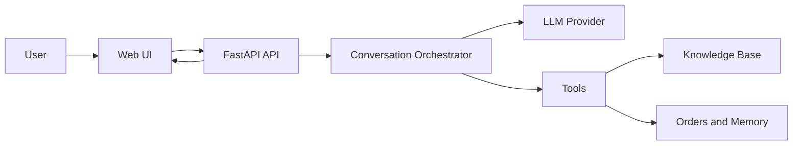
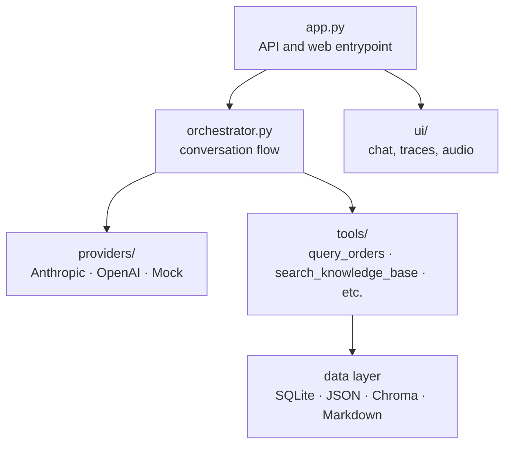

# ecom-agent

`ecom-agent` is a local AI agent demo for a fictional ecommerce brand called SaborMix. It combines a FastAPI backend, a small browser UI, a retrieval layer over Markdown knowledge files, and a tool-driven conversation loop that can answer product, recipe, support, and order-related questions.

The project is designed to show how a conversational agent can:

- answer grounded questions from a curated knowledge base,
- reason over a conversation in multiple steps,
- call tools for order lookup or persistence,
- expose execution traces for debugging, and
- support both Spanish and English prompts and content.

## Goals

The repository is intentionally structured as an end-to-end reference implementation rather than a single model wrapper. The main goal is to demonstrate how to assemble the pieces required for a practical agent:

- a web entrypoint and API,
- configurable LLM providers,
- a normalized internal message format,
- tool execution with permission checks,
- retrieval-augmented generation over business documents,
- lightweight memory and conversation compaction,
- deterministic local tests.

In product terms, the agent is meant to help customers with three domains:

- sales: product positioning, comparisons, shipping, returns, and purchase-related questions,
- recipes: guided usage of SaborMix devices with step-by-step cooking instructions,
- support: troubleshooting and operational help, plus structured issue extraction.

## Environment Setup

### Requirements

- Python 3.11 or newer
- `uv`
- an Anthropic API key and/or an OpenAI API key, depending on the provider you want to run

Install `uv` if you do not have it yet:

```bash
curl -LsSf https://astral.sh/uv/install.sh | sh
```

On macOS you can also install it with Homebrew:

```bash
brew install uv
```

### Clone and create the environment

From the project root:

```bash
uv venv
source .venv/bin/activate
uv sync --dev
```

What this does:

- `uv venv` creates a local virtual environment in `.venv/`
- `source .venv/bin/activate` activates it in your shell
- `uv sync --dev` installs runtime and development dependencies from `pyproject.toml`

If you prefer not to activate the environment manually, you can run everything through `uv run ...` instead.

### Configure secrets

Create a `.env` file in the repository root.

Example:

```env
ANTHROPIC_API_KEY=your_anthropic_key
OPENAI_API_KEY=your_openai_key
ELEVENLAB_API_KEY=your_elevenlabs_key
```

Important note: the retrieval layer currently uses OpenAI embeddings through Chroma, so `OPENAI_API_KEY` is required for knowledge-base ingestion and search even if the chat provider is set to Anthropic.

Audio-specific notes:

- `OPENAI_API_KEY` is also used by speech-to-text for customer audio uploads.
- `ELEVENLAB_API_KEY` enables text-to-speech replies.
- The setting name is intentionally `ELEVENLAB_API_KEY` in this repository to match `Settings.elevenlab_api_key`.

### Configure tunables

Runtime parameters live in `config.toml`. Secrets do not belong there.

Typical workflow:

1. Keep secrets in `.env`.
2. Keep stable runtime defaults in `config.toml`.
3. Override individual values with environment variables when needed.

The settings precedence is:

```text
environment variables > .env > config.toml > code defaults
```

Nested overrides use double underscores. Example:

```bash
LLM__PROVIDER=openai
LLM__TEMPERATURE=0.2
AGENT__DEFAULT_LANGUAGE=en
```

## Running The Project

### 1. Build or refresh the knowledge base index

The Markdown documents under `SaborMix/` are not useful to retrieval until they are ingested into Chroma.

```bash
uv run python scripts/ingest.py
```

This reads the localized Markdown files, chunks them into paragraphs, and stores embeddings under the configured Chroma persistence directory.

### 2. Start the web server

```bash
uv run uvicorn ecom_agent.app:app --reload
```

Then open:

```text
http://127.0.0.1:8000
```

The FastAPI app serves both:

- the JSON API used by the frontend,
- the static browser UI from `ui/`.

### 3. Audio features in the UI

The browser UI now supports both spoken replies and spoken customer input.

- The `Texto / Voz` toggle controls how the assistant answers. `Texto` is the default.
- In `Voz` mode, the backend rewrites the final reply into listening-first copy, synthesizes it with ElevenLabs, and returns both the text reply and the audio clip.
- The selected voice depends on the active UI language: Spanish uses a female Spanish profile, English uses a female US English profile.
- The voice player in the chat supports play/stop, seek, and 10-second forward/back jumps.
- The microphone in the composer lets the user record audio, pause/resume, delete it, send it directly, and replay the sent clip from the chat after upload.
- Audio uploads are transcribed server-side and continue through the exact same agent pipeline as normal text turns.
- Structured extraction is shown inside each turn trace, so the UI makes visible which fields were collected for that interaction without adding a separate persistent summary panel.

### 4. Optional smoke check

To verify that the configured provider can answer a trivial prompt:

```bash
uv run python scripts/smoke.py
```

## Testing

Install development dependencies first:

```bash
uv sync --dev
```

Run the full test suite:

```bash
uv run pytest tests/ -q
```

The current tests cover the main local building blocks:

- agent loop behavior,
- compaction strategies,
- orders database operations,
- provider normalization,
- speech-to-text normalization,
- structured turn extraction,
- voice synthesis fallback behavior,
- write-order tool behavior.

## How The System Works

High-level request flow:



At runtime, the request flow is:

1. the browser UI sends a message to `POST /chat`,
2. optionally, the browser UI can upload recorded audio to `POST /chat/audio`,
3. FastAPI resolves or creates a session-bound `Conversation`,
4. audio turns are first transcribed to text and then follow the normal turn flow,
5. the conversation sends the current message history to the configured model provider,
6. if the model requests tools, the tool registry executes them under a permission policy,
7. tool results are fed back into the conversation loop,
8. when the model emits a final answer, the API returns the reply plus a structured trace,
9. if the UI requested voice output, the backend also synthesizes a spoken version of the final answer,
10. the UI renders the answer, the optional audio player, and the internal execution trace.

This loop is implemented to make reasoning visible. The user does not just receive a final answer; the frontend can also inspect how many provider calls were made, which tools were used, and what structured metadata was extracted from the turn.

Structured extraction is accumulated at the conversation level. Fields such as `order_number`, `problem_category`, `problem_description`, and `urgency_level` are preserved across turns as the interview progresses. Frustration is tracked with two signals:

- `frustration`: the current frustration inferred from the latest customer turn,
- `peak_frustration`: the highest frustration observed during the session.

## API Overview

The frontend currently uses three HTTP endpoints:

- `GET /` serves the static chat UI.
- `POST /chat` accepts a text turn with `session_id`, `message`, `lang`, and `response_mode` (`text` or `voice`).
- `POST /chat/audio` accepts a recorded clip with `session_id`, `audio_base64`, `mime_type`, `filename`, `lang`, and `response_mode`.
- `POST /summary` returns a summary for the current session.

Both `POST /chat` and `POST /chat/audio` return a normalized payload containing:

- `reply`: the final assistant text,
- `input_mode`: `text` or `audio`,
- `input_text`: the original message or transcript,
- `output`: either a text payload or a voice payload with base64 audio,
- `trace`: provider calls, tool usage, token accounting, and extraction metadata.

The extraction payload currently includes:

- `order_number`
- `problem_category`
- `problem_description`
- `urgency_level`
- `frustration` (current turn-level state)
- `peak_frustration` (highest session-level value seen so far)

## Key Design Decisions / Tradeoffs

This repository intentionally favors clarity, modularity, and inspectability over hiding complexity behind a single abstraction.

- Provider abstraction through classes and polymorphism: the rest of the system talks to models through the shared `LLMProvider` contract, so `anthropic`, `openai`, and `mock` providers can be swapped without rewriting the orchestrator, tools, or API surface.
- Modular boundaries by responsibility: the app, orchestrator, providers, tools, RAG layer, persistence layer, prompts, and UI are kept separate so each part can evolve independently and be tested in isolation.
- Prompt and provider isolation: prompt files live outside code and provider-specific SDK logic lives behind adapters. That keeps prompt iteration and model changes local instead of leaking across the whole project.
- Visible traces instead of a black-box chatbot: the UI exposes provider calls, tool executions, token usage, and structured extraction so the agent can be debugged and defended during a technical review.
- Local-first persistence for the assignment: SQLite is used for orders, while JSON files keep both the raw conversation log and the latest structured case snapshot easy to inspect locally.
- Safety over autonomous side effects: in the current runtime configuration the app only allows read-oriented tools such as order lookup and knowledge-base search. This is deliberate. The agent can extract information and consult systems, but it does not perform automatic writes in the main flow without an explicit permission decision.

That last point is an explicit tradeoff. The codebase already separates read and write capabilities, and write tools exist, but the default app policy intentionally keeps mutation disabled in the main demo path. For a technical assignment, that makes the behavior safer and easier to evaluate. In a production setup, the next step would be a confirmation flow or a human-in-the-loop approval step before enabling write-side actions.

## Architecture

High-level module view:



### High-level components

- FastAPI application: receives chat requests, serves the UI, and holds in-memory conversation sessions.
- Conversation orchestrator: owns message history, runs the provider-tool loop, compacts context, and records debug traces.
- Providers: adapt different LLM SDKs into one shared response format.
- Tools: expose capabilities such as order lookup, recall, knowledge search, and write operations.
- RAG layer: indexes Markdown business content and retrieves localized passages.
- Persistence layer: stores orders in SQLite and lightweight memory in JSON files.
- Frontend: provides a small chat interface and visual trace explorer.

### Why `src/` is organized this way

The `src/ecom_agent/` package separates the core agent by responsibility, not by framework layer alone. That matters because agent systems mix deterministic code, LLM adapters, data stores, prompts, and policy checks. Splitting them into focused modules keeps each concern replaceable and testable.

#### `src/ecom_agent/app.py`

The application entrypoint. It wires together settings, provider, database, knowledge base, memory store, compaction strategy, and conversation sessions. It also exposes:

- `GET /` for the UI,
- `POST /chat` for one conversational turn,
- `POST /chat/audio` for customer audio uploads,
- `POST /summary` for a session summary.

This file should stay thin: it composes services, but does not implement the agent logic itself.

#### `src/ecom_agent/orchestrator.py`

This is the core of the agent. It owns the conversation loop and decides what happens on each turn:

- append the user message,
- optionally persist memory,
- compact history if configured,
- call the provider,
- detect tool requests,
- dispatch tools safely,
- append tool results back into the transcript,
- accumulate structured extraction across turns,
- return the final answer and trace.

This separation is important because the orchestrator is the behavior engine, while `app.py` is only the delivery surface.

#### `src/ecom_agent/config.py`

Defines the typed application settings. It merges values from code defaults, `config.toml`, `.env`, and environment variables. This keeps configuration explicit and validated through Pydantic instead of scattering `os.getenv()` calls across the codebase.

#### `src/ecom_agent/providers/`

Contains provider adapters and the provider factory.

- `base.py` defines the provider contract.
- `anthropic_provider.py` and `openai_provider.py` normalize each SDK into the internal `Response` format.
- `factory.py` is the single place that maps config to a concrete provider.
- `mock.py` supports tests and local deterministic behavior.

This keeps the rest of the system provider-agnostic. The implementation relies on a class-based design with polymorphism: each provider adapter implements the same interface, so the system can switch providers without changing the orchestration logic.

#### `src/ecom_agent/domain/`

Contains internal types and domain-level data structures.

- `types.py` defines normalized messages, tool blocks, tool definitions, usage counters, and responses.
- `turn_extraction.py` models the structured metadata extracted from user turns.
- `order.py` contains order-related domain modeling.

These types are the shared language between providers, tools, the orchestrator, and tests.

#### `src/ecom_agent/tools/`

Implements the capabilities the model can call.

- `base.py` defines the tool contract.
- `registry.py` registers tools, publishes tool schemas, and dispatches calls.
- concrete tool modules implement isolated capabilities such as querying orders, writing orders, recalling memories, and searching the knowledge base.

Tools are kept separate because they are the boundary between model reasoning and deterministic side effects.

#### Permission tradeoff in the current app

The default FastAPI runtime only authorizes read-oriented tools in the main conversation flow. In practice, that means the agent can consult the order store and the knowledge base, but it does not execute write operations automatically from the public chat flow.

This is intentional for the assignment:

- it makes the demo safer to run locally,
- it keeps side effects explicit,
- it shows the permission boundary clearly,
- and it leaves room for a later confirmation or approval mechanism before enabling writes.

So the current behavior is: the agent extracts structured information, reasons over it, and can query supporting systems, but it does not mutate operational data by default.

#### `src/ecom_agent/db/`

Contains the SQLite-backed order store. The database logic is isolated from the tool layer so read and write operations can be exposed differently and guarded by policy.

#### `src/ecom_agent/rag/`

Implements indexing and retrieval over the localized Markdown knowledge base. This module is responsible for:

- reading Markdown files from `SaborMix/`,
- chunking them into retrieval-friendly passages,
- storing embeddings in Chroma,
- filtering search results by language and optionally by area.

This separation keeps retrieval concerns independent from the conversation loop.

#### `src/ecom_agent/memory/`

Provides long-lived memory persistence. The default implementation writes JSON session logs under `.data/memory` and stores the latest structured case snapshot under `.data/memory/cases`. It is intentionally simple so the rest of the code depends on a storage interface rather than a specific backend.

#### `src/ecom_agent/compaction/`

Contains strategies that reduce conversation history before sending it back to the model. The goal is to manage context growth without changing the rest of the orchestration logic. The factory selects between no compaction, sliding-window compaction, and summarization-based compaction.

#### `src/ecom_agent/prompts/`

Stores system prompts, turn extraction prompts, and summarization prompts, with language-specific variants under `en/` and `es/`. Prompts are versioned as files instead of inline strings so they can be reviewed, localized, and tested as part of the codebase.

#### `src/ecom_agent/prompt_loader.py`

Resolves prompt files with language-aware fallback logic. This keeps prompt lookup consistent and removes filesystem logic from the orchestrator.

#### `src/ecom_agent/permissions.py`

Defines authorization policies for tools. This makes permission decisions explicit and composable. For example, the app can allow safe read tools while blocking side-effecting tools unless explicitly authorized.

### Relationship between the modules

The dependency direction is intentionally simple:

- `app.py` composes the runtime,
- `orchestrator.py` coordinates the flow,
- `providers/`, `tools/`, `rag/`, `db/`, `memory/`, and `compaction/` provide specialized services,
- `domain/` provides shared types used across those services,
- `prompts/` supplies externalized prompt content consumed by the orchestrator.

That structure keeps the core loop understandable and makes it easier to swap a provider, change storage, add a tool, or tune prompts without rewriting unrelated pieces.

## `config.toml` Explained

`config.toml` contains non-secret runtime settings. Its sections map directly to typed configuration models in `src/ecom_agent/config.py`.

### `[llm]`

Controls the main language model used by the conversation loop.

- `provider`: which adapter to instantiate, currently `anthropic` or `openai`
- `name`: model identifier passed to the chosen SDK
- `max_tokens`: output token cap for provider calls
- `temperature`: sampling temperature
- `top_p`: optional nucleus sampling parameter

### `[agent]`

Controls the orchestration loop.

- `max_steps`: maximum number of model-tool iterations before the loop stops
- `default_language`: default conversation language when the UI does not override it

### `[db]`

Controls SQLite persistence.

- `path`: location of the local orders database file

### `[rag]`

Controls retrieval over the Markdown knowledge base.

- `kb_root`: root folder containing the SaborMix documents
- `collection`: Chroma collection name
- `persist_dir`: location of the persistent vector store
- `embedding_model`: OpenAI embedding model used during ingestion and search
- `top_k`: default number of retrieved passages

### `[compaction]`

Controls how chat history is reduced before provider calls.

- `strategy`: `none`, `sliding`, or `summarize`
- `threshold`: when summarization-based compaction should activate
- `keep_recent`: number of recent messages to preserve verbatim

### `[voice]`

Controls text-to-speech output.

- `model_id`: ElevenLabs model used for synthesis
- `audio_format`: output codec and bitrate returned to the UI
- `spanish_voice_id`: preferred Spanish voice ID
- `english_voice_id`: preferred English voice ID
- `spanish_voice_label`: label shown in the UI for Spanish playback
- `english_voice_label`: label shown in the UI for English playback
- `stability`, `similarity_boost`, `style`, `use_speaker_boost`: ElevenLabs voice settings
- `timeout_seconds`: network timeout for synthesis requests

If the configured voice is unavailable for the current ElevenLabs plan, the app retries with a public fallback voice instead of failing the whole turn.

### `[stt]`

Controls speech-to-text for customer audio input.

- `model`: OpenAI transcription model used by `POST /chat/audio`
- `timeout_seconds`: network timeout for transcription requests

## Other Important Folders

### `SaborMix/`

This is the source knowledge base. It contains localized Markdown content grouped by business area:

- `products/`
- `recipes/`
- `support/`

Each area is split into `es/` and `en/`. These files are the agent's grounded business knowledge and are ingested into the vector store by `scripts/ingest.py`.

### `ui/`

Contains the static frontend served by FastAPI.

- `index.html` defines the page shell.
- `app.js` manages chat state, sends API requests, switches language, and renders execution traces.
- `app.js` also handles voice playback, audio recording, and upload/transcription flows.
- extraction is shown in the trace for each turn, including the current frustration value returned by the backend.
- `styles.css` defines the presentation.

This folder is intentionally separate from `src/` because it is a static client, not part of the Python package.

### `scripts/`

Contains operational helper scripts.

- `ingest.py` builds or refreshes the Chroma index from the Markdown corpus.
- `smoke.py` performs a minimal provider call to verify credentials and model connectivity.

These scripts keep one-off operational tasks out of the main application package.

### `tests/`

Contains the automated test suite.

- `test_agent_loop.py` validates orchestration behavior.
- `test_compaction.py` checks history compaction strategies.
- `test_orders_db.py` covers SQLite persistence behavior.
- `test_provider.py` checks provider abstractions.
- `test_stt.py` validates speech-to-text handling.
- `test_turn_extraction.py` validates structured extraction behavior.
- `test_voice.py` validates voice adaptation and fallback behavior.
- `test_write_order.py` covers write-side tool behavior.

Tests live outside `src/` to keep production code and verification code clearly separated.

## Daily Development Commands

Common commands from the repository root:

```bash
# create the virtual environment
uv venv

# install runtime + dev dependencies
uv sync --dev

# rebuild the RAG index
uv run python scripts/ingest.py

# run the app locally
uv run uvicorn ecom_agent.app:app --reload

# run the full test suite
uv run pytest tests/ -q

# run a provider smoke test
uv run python scripts/smoke.py
```

## What This Project Is Trying To Achieve

The project is not just trying to answer questions with an LLM. It is trying to show a disciplined agent architecture where:

- knowledge is grounded in a maintained document set,
- components are modular and replaceable,
- providers can be swapped through a shared class interface,
- side effects happen through explicit tools,
- prompts are externalized and localized,
- configuration is typed and reproducible,
- traces make model behavior inspectable,
- tests cover the deterministic parts of the system.

That makes the repository useful both as a teaching example and as a base for extending the SaborMix use case into a more complete customer-service agent.

## Future Improvements

The current repository is intentionally scoped as a local demo project. If it were extended beyond the demo stage, the most valuable next steps would be:

- **Production-grade retrieval pipeline**  
  Improve the RAG stack with better chunking strategies, metadata filtering, reranking, and quality evaluation so grounded answers remain reliable as the knowledge base grows.

- **Safer write workflows**  
  Introduce explicit confirmation flows or human-in-the-loop approval before enabling side-effecting tools such as order updates. This would preserve the current safety model while making the agent more operational.

- **Durable conversation and case storage**  
  Move conversations, extracted structured data, and summaries from local JSON files and in-memory session state into a proper database for persistence, querying, and auditing.

- **API-level error normalization**  
  Standardize backend error handling across text, audio, transcription, and voice synthesis flows so the frontend receives consistent error payloads and recovery paths.

- **Richer session and user management**  
  Add persistent conversation history, user identities, and better session lifecycle handling so the system can support longer-running customer interactions.

- **Stronger observability and evaluation**  
  Add metrics, structured logs, prompt/version tracking, and automated evaluation datasets to measure answer quality, extraction accuracy, and tool behavior over time.

- **Expanded provider and deployment flexibility**  
  Keep the provider abstraction but extend it with easier runtime switching, environment-specific configuration, and deployment-friendly infrastructure for staging and production setups.

- **Knowledge layer decoupling**  
  Extract the retrieval subsystem into a dedicated service, such as an MCP-compatible knowledge server, so the conversational agent can stay focused on orchestration while knowledge management evolves independently.

- **Improved multimodal experience**  
  Continue refining the voice UX with better playback states, transcript visibility, streaming responses, and more resilient audio handling across browsers and devices.

- **Real business system integration**  
  Replace the demo order database with real operational systems, with proper authentication, authorization, and audit controls, so the agent can act on live customer context safely.
